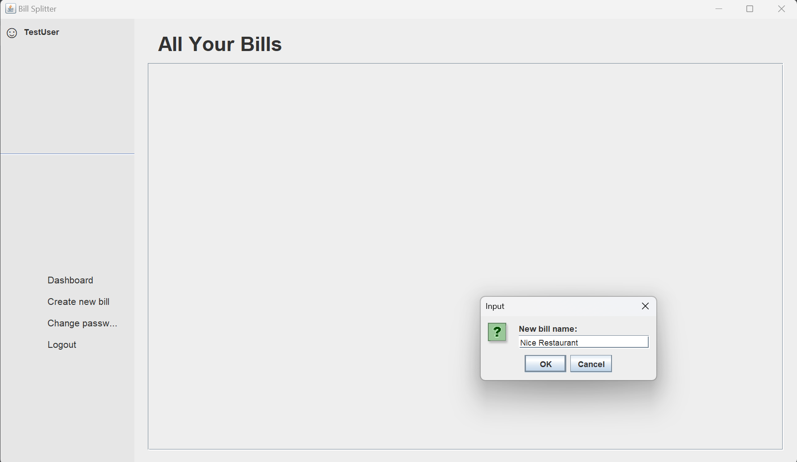
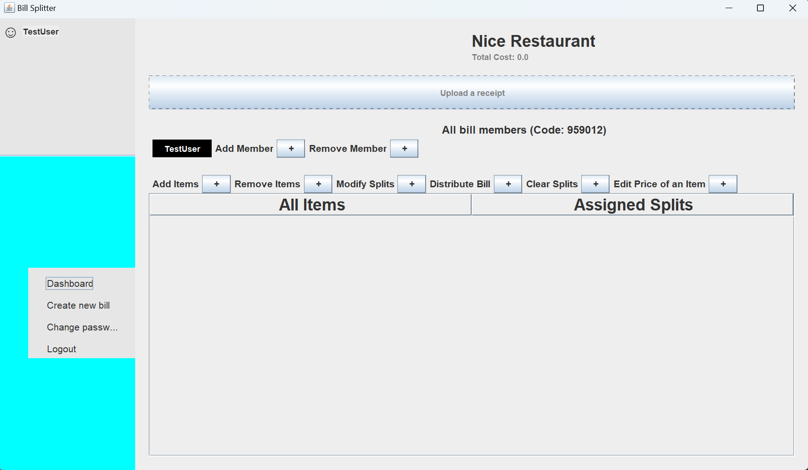

# **Bill-Splitter**
**Authors: Colleen Chang, Jordan Shao, Toryn Chua, Andres Li, Jacob Mathew Keluthara**
## Purpose
Picture this: you are out with a large group of friends and decide to eat at a restaurant. After enjoying a nice meal\
at this restaurant, you and your friends realize that the restaurant only gives their bills in one large bill rather\
than splitting it between each individual. Calculating how much each person needs to pay then becomes much more\
difficult as not only are there a lot of individuals to consider, but there are some people who ate one dish together\
and want to split the price of the item as well. This is where the Bill-Splitter application is helpful as it allows\
the user to upload their receipt and keep track of who is paying how much for each item on the receipt. The user simply\
uploads a picture of their receipt to the application, and the application will use the Receipts OCR API by Veryfi to\
list out all the items and their prices and the user can then edit the items and their splits without the headache of\
managing each split by hand.
## Table Of Contents
1. [Features](#Features)
2. [Installation](#Installation)
3. [Usage](#Usage)
4. [License](#License)
5. [About Feedback](#About-Feedback)
6. [About Contributions](#About-Contributions)
## Features
This program allows the user to create their account with a username and password with each account having their own\
individual bills to create and manage. For each bill, they are able to add and remove people involved in the payment\
of the bill and manage how much each person pays for each item. Moreover, there is no need to individually add each\
item to the bill as the user has the option to simply upload a picture of their receipt into the application and the\
program will automatically add each item and their prices to the bill. However, the user still has the option to add or\
remove items as well as edit the pricing of each item in case the application makes a mistake.\
\
\
The login screen\
\
\
the main dashboard of the program with a bill named "Fast Food Restaurant"\
\

The bill managing page\

After uploading a receipt, the program will automatically add the items to the bill!
## Installation
This program requires the Intellij IDE and runs on java version 21.0.\
To install this program, visit the [Bill-Splitter github page](https://github.com/chexerboxer/Bill-Splitter) and click on\
the "fork" button and create your own fork of the github repository:\
\
\
Next, in the github page of the fork, click on the large green "Code" button and copy the link:
\
\
Then, on your Intellij IDE, select file > new > project from version control:\
\
Paste the link and click on "clone". Then, on the project window go to src > main > java > app and run the "Main" file:\
\
and now, you can use the application as you please!
## Usage
As soon as the program is first run, you are able to input a username and password to create your account:\
\
Afterwards, input the credentials again on the login page to be directed to the dashboard:\
\
In the dashboard, the log out simply logs the user out and the change password button allows the user to change the\
account's password. To create a bill, click "create bill" and input the bill name:\
\
\
Click on the newly created bill to access its management window:\
\
Shown are all the things you can do to your code. You can add or remove members as well as adding or removing items.\
When adding an item, simply type in the item name and its cost and the item will be added. One of the biggest features\
is that the user can upload a picture of a receipt and the program will scan and add the items on the receipt to the\
bill. Here is an example of a receipt:\
\
Uploading this into the bill we get this result:\
\
As seen above, the price for the soft drinks are incorrect as it should be \$20 instead of \$10 as there are 2 soft\
drinks. There the option to edit the price of the item to fix this. Select the item and enter the correct price:\
\
Now let's add other members to the bill. Simply click the plus button next to "Add Member" to input a name and add a\
member (**ADDED USER MUST ALSO HAVE AN ACCOUNT**):\
\
\
Clicking on Distribute Bill splits each bill evenly across each selected member (selected members are TestUser \
and Andres):\
\
To modify a split, select the member and the item and input + or - followed by a number to change the split of the\
member on the item:\
\

## License
[MIT](https://choosealicense.com/licenses/mit/)
## About Feedback
## About Contributions

